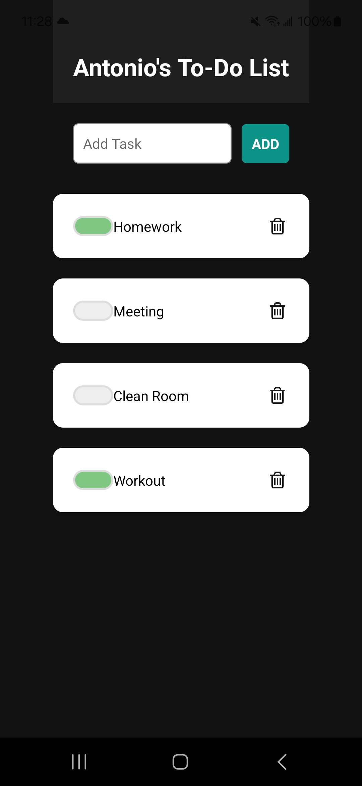
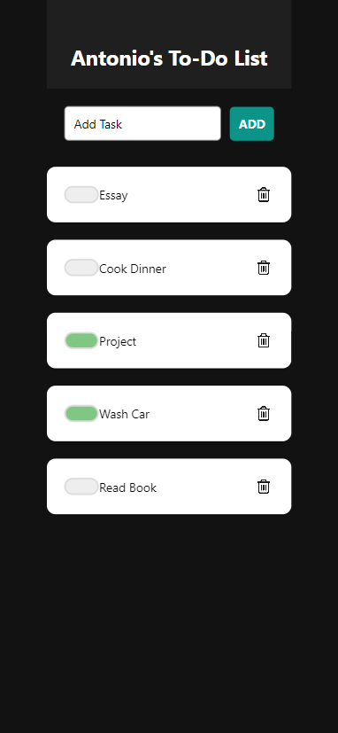

# Assignment 2 - To-Do List Manager

The To-Do List Manager app allows users to add new tasks, mark tasks as completed, and delete tasks. This project allowed us to develop a mobile application using React Native and enhaning our skills in handling elements, components, props, JSX, and state.

## Features

- Dark theme and sleek and responsive interface for web and mobile users.
- Add and Delete tasks to your list with ease.
- Mark tasks as completed and keep track.

## Prerequisites / Built With

- JavaScript
- React Native - framework
- [Expo](https://expo.dev/) - An open-source platform used for building and serving the application.
- Node.js - The runtime environment

## Setup / How to Run

1. To run the app, clone the repo using `git clone https://github.com/HernandezA1007/INF657-Assignment2`
2. npm start and either open in web or on mobile

## Gallery

Android view Expo Go

iPhone 12 view Web version

